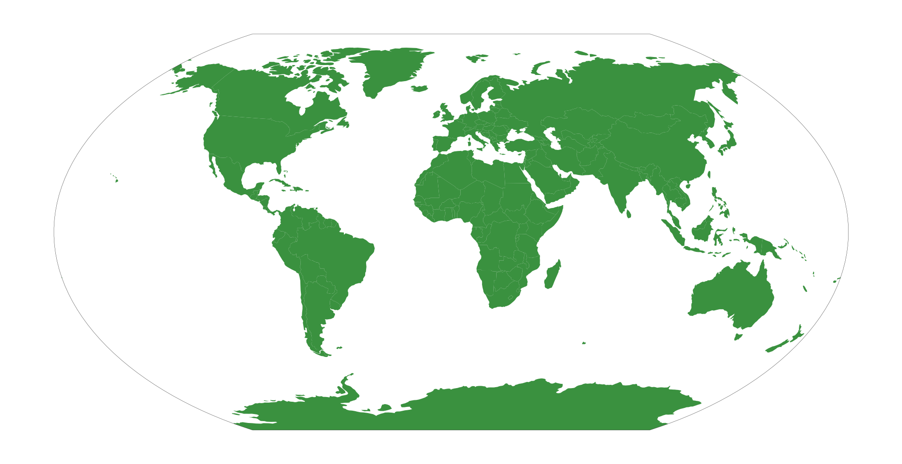

# ALLFED-map-border

The file border.geojson holds a shape of the world, allowing global maps to have a border.

The data is in a Winkel Tripel projection, the standard for global ALLFED maps. If you require a different projection, you can use geopandas to reproject the border data.

An example is given in 'plotter.ipynb'.

